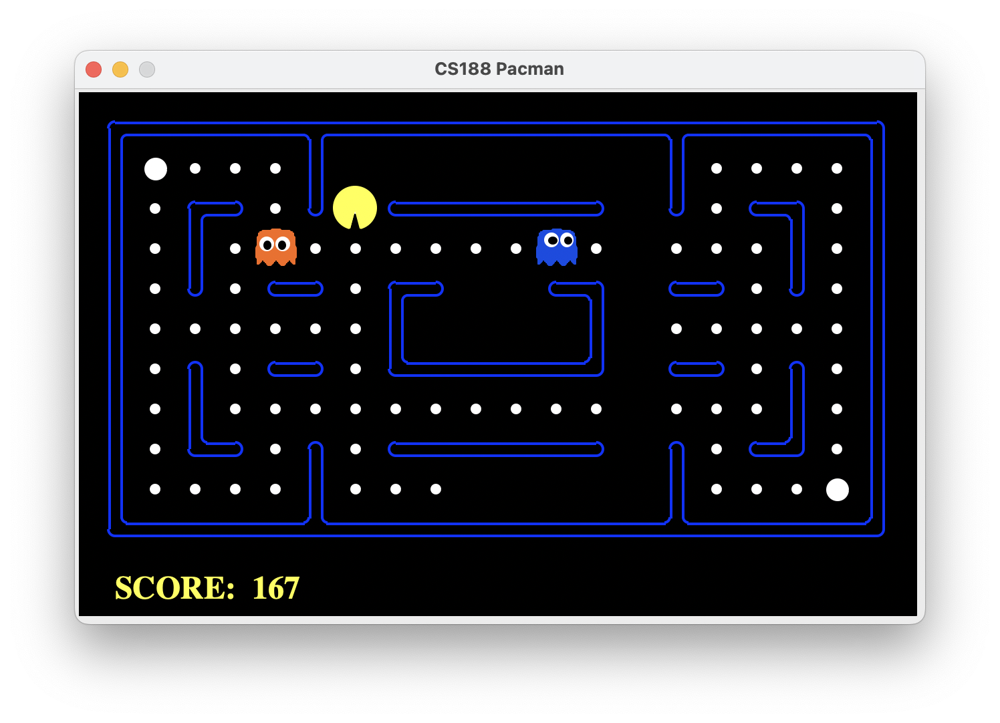

# Pacman MDP-solver
<div align='center'>

<!-- <figcaption>Small Grid</figcaption> -->
</div>
<p align='center'>

</p>

## Coursework set-up

Code is written in Python 2.7

Multiple version of Python can be managed using either conda or pyenv

```bash
brew install pyenv

pyenv install 2.7

# This creates a .python-version file which tells pyenv 
# which version of python to run in that directory.
pyenv local 2.7

# Or you can set a global python version
# Load pyenv automatically by appending
# the following to ~/.bash_profile:
eval "$(pyenv init -)"

pyenv global 2.7
```

```bash
# running the program in smallGrid layout
python pacman.py -q -n 25 -p MDPAgent -l smallGrid
# -l is shorthand for -layout. 
# -p is shorthand for -pacman 
# -q runs the game without the interface ( making it faster ) .
# -n 25 runs 25 games in a row

# running the program in mediumClassic layout
python pacman.py -q -n 25 -p MDPAgent -l mediumClassic
```

## More info

This coursework consist of writing code to control Pacman and win games using an MDP-solver. For each move, we model the Pacman’s world, which consists of all the elements of a Markov Decision Process.

Following this we need to compute which action to take via Policy Iteration.

Additionally, there is a difference between winning a lot and winning well. High excellence score is an indication for this. To reach a high excellence score two strategies were implemented:

1. chase the ghost if possible (eatable)
1. implement a variable reward for food and ghost. So that at the end of the game, out agent knows that eat all food and finish the game is more important than chasing ghost.